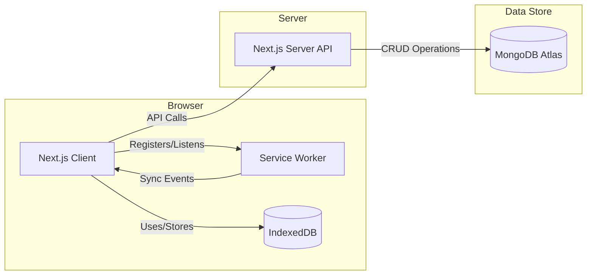

# Offline Notes App - Enhanced Implementation

## Overview

I've enhanced the offline-notes application with a complete backend implementation using MongoDB Atlas, added filtering features, and polished the UI. The application is now fully functional both online and offline, with seamless synchronization when connectivity is restored.

## How to Run the App

### Prerequisites
- Node.js (v16 or higher)
- MongoDB Atlas account or local MongoDB instance
- Netlify account (for deployment)

### Local Development

1. **Clone the Repository:**
    ```bash
    git clone https://github.com/Praveenverma1510/offline-notes-test
    cd offline-notes-test
    ```

2. **Install Dependencies:**
    ```bash
    npm install
    ```

3. **Set Up Environment Variables:**
    Create a `.env.local` file in the root directory with:
    ```env
    MONGODB_URI=your_mongodb_atlas_connection_string
    NEXT_PUBLIC_BASE_URL=http://localhost:3000
    ```

4. **Run Development Server:**
    ```bash
    npm run dev
    ```
    Open [http://localhost:3000](http://localhost:3000) in your browser.

### Deployment

The app is hosted on Netlify at: [https://offline-notes-test.netlify.app/](https://offline-notes-test.netlify.app/)

## Technical Implementation Details

### Backend Data Store

**Choice:** MongoDB Atlas

**Why MongoDB?**
- Flexible schema works well with the notes structure that may evolve
- Easy to scale with Atlas
- Native JSON support matches well with our frontend data structure
- Good performance for read/write operations needed for a notes app

**Implementation:**
- Created a `notes` collection in MongoDB Atlas
- Implemented all CRUD operations in the API routes:
  - `pages/api/notes.js` - Fetch all notes
  - `pages/api/save-note.js` - Create new note
  - `pages/api/edit-note.js` - Update existing note
  - `pages/api/delete-note.js` - Remove note

**Database Schema:**
```javascript
{
  _id: ObjectId,
  title: String,
  content: String,
  tags: [String],
  createdAt: Date,
  updatedAt: Date,
}
```

### Tag Implementation

**State Management:**
- Combined `useState` and `useReducer` for complex tag operations
- Local tag state is synchronized with IndexedDB and MongoDB

**Storage Integration:**
- Tags are stored as simple strings for flexibility
- Implemented tag autocomplete using existing tags from local storage

**UI Components:**
- Tag input field with dropdown suggestions
- Visual tag pills with remove capability
- Color-coded tags for better visibility

### Filtering Implementation

**Client-Side Logic:**
- Filtering works on the locally available notes in IndexedDB
- Supports multiple tag selection with AND logic

**UI Components:**
- Tag filter dropdown with search capability
- Visual indicators for active filters


### UI Improvements

**Enhancements:**
- Modern, clean interface with Tailwind CSS
- Responsive design for all device sizes
- Animated transitions for better UX
- Improved note editor with markdown support
- Better visual hierarchy and spacing
- Loading states and error handling

## Architecture Updates



## Key Features Added

1. **Complete MongoDB Backend Integration**
   - Fully implemented all CRUD operations
   - Proper error handling and data validation
   - Optimized queries for performance

2. **Enhanced Offline Capabilities**
   - Improved IndexedDB operations
   - Better sync logic between local and remote
   - Conflict detection system

3. **Advanced Filtering**
   - Filter by multiple tags
   - Search within filtered results
   - Persistent filter state

4. **Polished UI/UX**
   - Modern, clean interface
   - Responsive design
   - Improved editor experience

## Future Improvements

1. **User Authentication**
   - To support multiple users
   - Secure note storage

2. **Advanced Conflict Resolution UI**
   - Side-by-side diff view
   - Merge capabilities

3. **Note Sharing**
   - Collaborate with others
   - Public/private notes

4. **Rich Text Editing**
   - More formatting options
   - Image support

5. **Performance Optimizations**
   - Pagination for large note collections
   - Lazy loading
